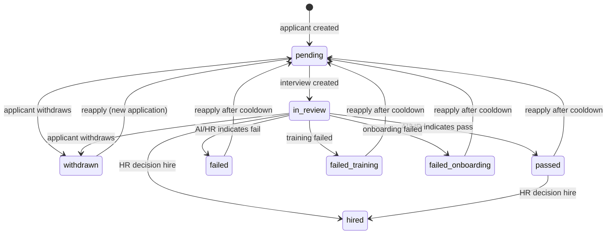

# Applicant Lifecycle State Diagram

This document describes the applicant lifecycle as implemented in the current codebase, including stored fields and derived states used by the UI. It avoids adding new business rules.

## Data sources (current)
- Applicant.status (stored)
- Applicant.reapplication_date (stored)
- Applicant.interview_completed (stored boolean)
- Interview.status (stored)
- Interview.hr_decision (stored, nullable)

## Stored applicant statuses (Applicant.status)
| Status value | Controller | Transition triggers (examples) | Visible in pages |
| --- | --- | --- | --- |
| pending | System | Applicant created; reapply after cooldown resets to pending | Applicants, Application Status |
| in_review | System | Interview created or interview started | Applicants, Application Status, HR Review Queue (via Interview) |
| passed | System/HR | AI/HR marks interview as passed but not hired | Applicants, Application Status |
| failed | System/HR | AI or HR rejection; authenticity fail | Applicants, Application Status |
| hired | HR | HR final decision hire | Applicants, Application Status |
| failed_training | HR/System | Training stage failure (outside interview scope) | Applicants |
| failed_onboarding | HR/System | Onboarding stage failure (outside interview scope) | Applicants |
| withdrawn | HR/Applicant | Applicant withdrawal | Applicants |

## Derived applicant states (not stored)
These are UI or reporting labels computed from Applicant and Interview data.

| Derived state | Computed rule | Primary purpose |
| --- | --- | --- |
| No Interview | applicant has no interviews | Applicants page indicator |
| Pending Interview | status=pending AND no active interview | Applicants page |
| Interview In Progress | any interview.status in [in_progress, submitted] | Applicants page, applicant-facing status |
| Interview Processing | any interview.status=processing | Applicants page, applicant-facing status |
| Interview Completed | latest interview.status=completed | Applicants page |
| Pending HR Decision | latest interview.status=completed AND hr_decision is null | HR Review Queue, Interview Review |
| Passed but Not Hired | status=passed | Applicants page |
| Reapplication Locked | status in [failed, failed_training, failed_onboarding, passed] AND reapplication_date in future | Applicants page, applicant-facing status |
| Eligible to Reapply | status in [failed, failed_training, failed_onboarding, passed] AND reapplication_date in past | Applicants page |
| Archived | Not implemented; future retention state | Docs only |

## State diagram (stored statuses only)


## Applicant and Interview relationship flow
```mermaid
flowchart LR
  A[Applicant created (status=pending)] --> B[Interview created (status=pending)]
  B --> C[Applicant status -> in_review]
  C --> D[Interview in_progress -> submitted -> processing -> completed]
  D --> E[InterviewResult + AI analysis stored]
  E --> F[HR review + per-question overrides]
  F --> G{HR decision}
  G -->|hire| H[Applicant status=hired]
  G -->|reject| I[Applicant status=failed + reapplication_date]
  G -->|hold| J[Applicant remains in_review]
```

## Notes
- The applicant lifecycle is driven by a combination of Applicant.status and Interview.status. Neither alone is sufficient for HR context.
- Reapplication eligibility is derived from reapplication_date and is not a stored status.
- "Archived" is not implemented as a model value; treat it as a future retention policy.
