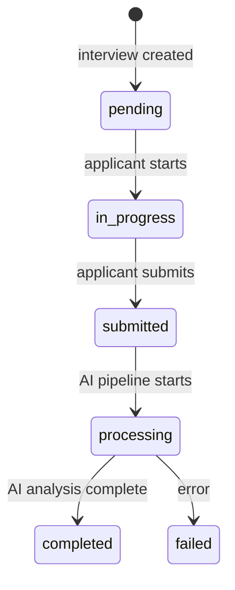
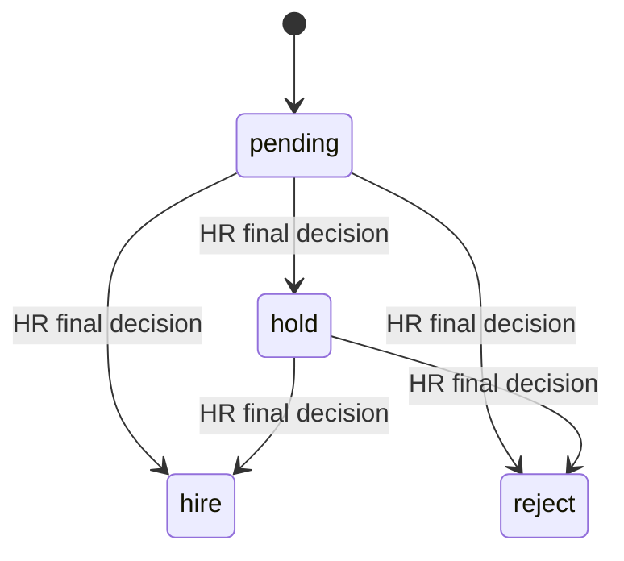
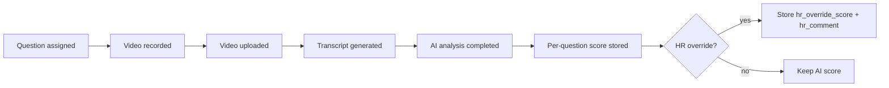

# Interview Lifecycle State Diagram

This document describes the interview lifecycle, question/video processing flow, and HR decision sub-state. It aligns with the current Django models and Celery pipeline.

## Data sources (current)
- Interview.status (stored)
- Interview.hr_decision (stored, nullable)
- Interview.completed_at (stored)
- VideoResponse.status (stored)
- AIAnalysis (stored per VideoResponse)

## Interview.status (stored)
| Status value | Controller | Trigger / transition | Side effects | Visible in pages |
| --- | --- | --- | --- | --- |
| pending | System | Interview created | Creates interview shell | Applicant-facing, Applicants |
| in_progress | System | Applicant starts answering | VideoResponse uploads begin | Applicant-facing |
| submitted | System | Applicant submits all answers | May immediately advance to processing | Applicant-facing |
| processing | System (Celery) | AI pipeline starts | Transcript + AI analysis per question | HR Review Queue (when completed) |
| completed | System (Celery) | AI pipeline completes | InterviewResult + AI summary stored | HR Review Queue, Interview Review, Interview Records |
| failed | System | AI pipeline error or processing failure | error_message stored | HR Review Queue, Interview Records |

## HR decision sub-state (Interview.hr_decision)
This is independent of Interview.status and only intended to be set after completion.

| hr_decision value | Controller | Trigger | Expected effect |
| --- | --- | --- | --- |
| null (pending) | HR | No decision recorded yet | Interview remains in HR Review Queue |
| hire | HR | Final decision hire | Applicant.status = hired |
| reject | HR | Final decision reject | Applicant.status = failed + reapplication_date |
| hold | HR | Needs more review | Keeps applicant visible in Review Queue |

## Question / video lifecycle (VideoResponse.status)
| Status value | Controller | Trigger | Side effects |
| --- | --- | --- | --- |
| uploaded | System | Applicant uploads video response | Transcript queued | 
| processing | System (Celery) | Transcription/analysis starts | Transcript in progress | 
| analyzed | System (Celery) | AI analysis complete | AIAnalysis saved, ai_score stored | 
| failed | System | Processing error | error details stored | 

## Interview state diagram (stored)

## HR decision sub-state diagram

## Question and AI processing flow

## AI advisory vs HR authority
- AI outputs (per-question scores, aggregate score, recommendation) are advisory.
- HR decisions are authoritative and recorded separately as Interview.hr_decision.
- HR overrides adjust per-question scores only; they do not directly set final decisions.

## Notes
- "Archived" interview state is not implemented as a model value.
- If Interview.status is completed but hr_decision is null, the UI should show "Pending HR Review".
